# Telephone Billing System - BruBank

[](https://nestjs.com/)
[](https://www.typescriptlang.org/)

Telephone call processing and invoice generation system with different billing strategies, developed with NestJS following SOLID principles and Clean Architecture.

## 🚀 Key Features

- **CSV processing** with format validation
- **Multiple billing strategies** (national, international, friends)
- **Extensible system** for new call types
- **Dynamic configuration** using environment variables
- **Billing period validation**
- **API documentation** with OpenAPI/Swagger
- **Robust typing** with TypeScript
- **Unit and integration tests** with Jest

## 🏗 Project Structure

```bash
src/
├── billing/
│ ├── strategies/
│ │ ├── friend.strategy.ts # Friend calls strategy
│ │ ├── national.strategy.ts # National calls strategy
│ │ └── international.strategy.ts # International calls strategy
│ └── billing-context.ts # Billing context
├── users/
│ ├── dto/
│ │ └── user.dto.ts # User DTO
│ └── users.service.ts # Users service
├── invoices/
│ ├── constants.ts # Module constants
│ ├── invoices.controller.ts # Invoices controller
│ └── invoices.service.ts # Invoices service
├── utils/
│ └── utils.ts # Shared utilities
└── app.module.ts # Main module
```

## ⚙️ Configuration

1. Clone repository:

```bash
git clone https://github.com/SebaTOSS/brubank-challenge
cd brubank-challenge
```

2. Install dependencies:

```bash
npm install
```

3. Configure environment variables (create .env):

```bash
# Example .env
BILLING_NATIONAL_RATE=2.5
BILLING_INTERNATIONAL_RATE=0.75
BILLING_FREE_FRIEND_CALLS=10
USER_SERVICE_BASE_URL=http://some-user-api # User service base URL
```

## 🚨 Usage

To start the application, run:

```bash
npm run start
```

The application will be available at `http://localhost:3000`.

## 🧪 Testing

To run tests, use the following command:

```bash
npm run test
```

## 📚 API Documentation

The API documentation is available at `http://localhost:3000/api/documentation`.

## API Endpoints

- **GET /health**: Check the health of the application.
- **POST /invoice/generate**: Generate an invoice based on the provided payload.

```bash
curl -X POST http://localhost:3000/invoice/generate \
  -F "file=@calls.csv" \
  -F "phoneNumber=+549116543219" \
  -F "billingPeriodStart=2023-01-01" \
  -F "billingPeriodEnds=2023-01-31"
```

## 🧮 Call Cost Calculation Strategy Architecture

The billing system implements a Strategy Pattern to handle different call types, following SOLID principles for maintainability and extensibility.

### Strategy Breakdown

- National Calls Strategy

  - Condition: Same country code for origin/destination

  - Calculation: Fixed rate per call

  - Configuration:

```bash
env
BILLING_NATIONAL_RATE=2.5
```

- International Calls Strategy

  - Condition: Different country codes

  - Calculation: Rate × call duration (seconds)

  - Configuration:

```bash
env
BILLING_INTERNATIONAL_RATE=0.75
```

- Friend Calls Strategy

  - Condition: Destination in user's friends list

  - Calculation:

  - First N calls: Free

  - Subsequent calls: International rate × duration

  - Configuration:

```bash
env
BILLING_FREE_FRIEND_CALLS=10
```

### Architectural Implementation

```mermaid
graph TD
    A[Billing Context] --> B{Call Type}
    B -->|National| C[National Strategy]
    B -->|International| D[International Strategy]
    B -->|Friend| E[Friend Strategy]
    C --> F[Fixed Rate]
    D --> G[Duration × Rate]
    E --> H[Free Tier + International Rate]
```



### Key Design Features

### Strategy Registration

Strategies are registered in priority order:

```typescript
context.registerStrategy(friendStrategy);
context.registerStrategy(internationalStrategy);
context.registerStrategy(nationalStrategy);
```

### Runtime Determination

For each call, the system:

1. Creates billing context with call metadata
2. Checks all registered strategies
3. Selects first applicable strategy
4. Delegates calculation to selected strategy
Extensibility Example
Add new strategies without modifying existing code:

```ts
// weekend.strategy.ts
@Injectable()
export class WeekendStrategy implements BillingStrategy {
  shouldApply(context) {
    return isWeekend(context.metadata.timestamp);
  }
  
  calculateCost(context) {
    return context.duration * WEEKEND_RATE;
  }
}
```

### Benefits Achieved

- Clear Separation: Each strategy encapsulates one pricing rule

- Central Configuration: Rates controlled via environment variables

- Testability: Strategies can be tested in isolation

- Flexibility: New call types added as independent modules

- Business Rule Integrity: Changes to one strategy don't affect others

This architecture allows BruBank to easily adapt to new pricing models while maintaining consistency across different call types.

## Contributing

Contributions are welcome! Please open an issue or submit a pull request for any enhancements or bug fixes.

## 📄 License

MIT License - See LICENSE for details.

___
Made with ❤️ by Seba - Questions? Open an issue!
